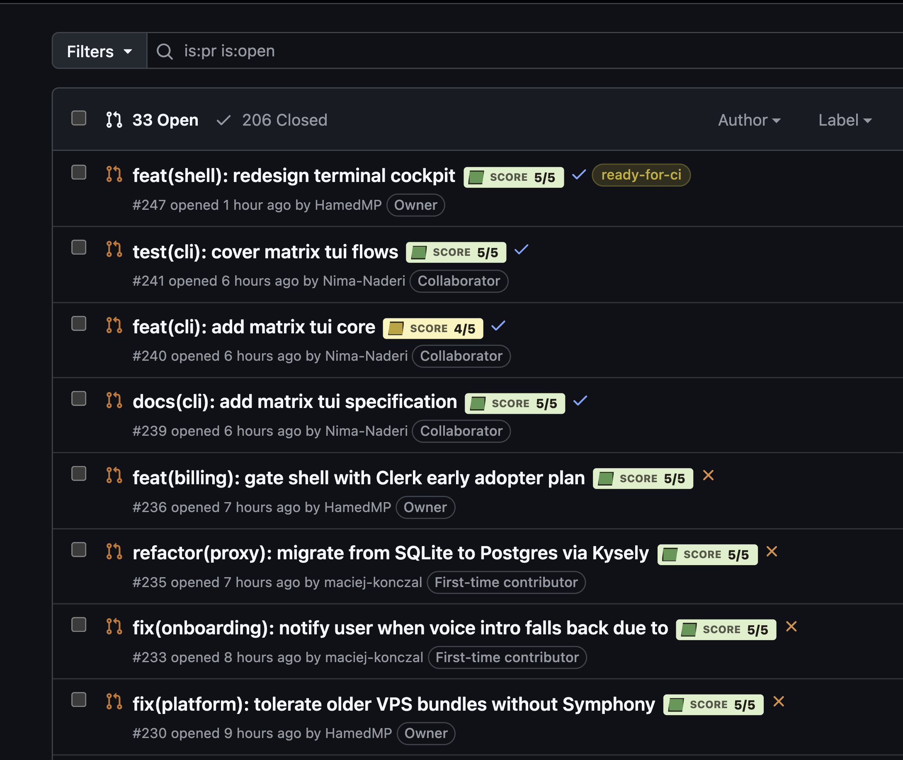

# Greptile PR Badges

Chrome extension that adds Greptile review score badges to GitHub pull request list views.



It reads Greptile’s GitHub PR summary comments and the latest PR head state, then displays compact badges such as:

- `Greptile 5/5`
- `Greptile 4/5 stale`
- `Greptile reviewing`
- `Greptile failed`
- `No Greptile`

## Why

GitHub’s PR list makes it hard to see which pull requests have a fresh Greptile review and which ones got new commits after the last review. This extension puts that state on the list view so you can triage quickly.

## How It Works

- Manifest V3 service worker handles GitHub API requests.
- Content script only runs on `https://github.com/*/*/pulls*`.
- One GraphQL request batches the visible PR rows instead of doing per-row requests.
- Results are cached in `chrome.storage.session` with `chrome.storage.local` fallback.
- The cache is short-lived and configurable from the options page.
- No Greptile API key is required. The extension reads Greptile’s GitHub comments and status checks through GitHub GraphQL.
- If GraphQL fails, the content script falls back to parsing the PR page that your browser session can already access.

## Setup

1. Create a GitHub fine-grained token with read access to the repositories you want to inspect.
   - Public repos: read-only public repository access is enough.
   - Private repos: grant read access to the specific private repositories.
   - The extension only sends this token to `https://api.github.com/graphql`.
2. Run:

   ```bash
   pnpm install
   pnpm run build
   ```

3. Open `chrome://extensions`.
4. Enable Developer Mode.
5. Click “Load unpacked” and select either the project folder or `dist/`.
6. Open the extension settings, paste the GitHub token, and click “Test GraphQL”.

For public repositories, GitHub GraphQL still expects authentication, so a token is recommended.

If you loaded the extension before running `pnpm run build`, click “Reload” on the extension card after building.

## Development

```bash
pnpm run test
pnpm run typecheck
pnpm run build
pnpm run verify
```

## Chrome Web Store Publishing

1. Register a Chrome Web Store developer account in the [Developer Dashboard](https://chrome.google.com/webstore/devconsole/). Google requires developer account registration before publishing.
2. Build the extension:

   ```bash
   pnpm install
   pnpm run verify
   ```

3. Package only the built extension files:

   ```bash
   cd dist
   zip -r ../greptile-pr-badges.zip .
   ```

4. In the Developer Dashboard, create a new item and upload `greptile-pr-badges.zip`.
5. Fill in the listing details:
   - Name: `Greptile PR Badges`
   - Category: Developer Tools
   - Description: explain that it displays Greptile scores on GitHub PR lists
   - Screenshots: use `assets/screenshot.png`
   - Support URL: this repository’s issues page
6. Complete the privacy practices section:
   - Disclose that the extension stores a GitHub token locally in Chrome storage.
   - Disclose that it sends the token only to `https://api.github.com/graphql`.
   - Disclose that it reads GitHub PR list and PR page content to render badges.
7. Choose visibility:
   - Public for a normal listing.
   - Unlisted if you only want people with the direct link to install it first.
8. Submit for review.

Official publishing guide: [Publish in the Chrome Web Store](https://developer.chrome.com/docs/webstore/publish/).

## Permissions

- `storage`: stores the GitHub token and short-lived PR status cache.
- `https://api.github.com/*`: reads PR comments, head SHAs, and status check rollups.
- `https://github.com/*/*/pulls*`: injects badges into GitHub PR list pages.

## Notes

Greptile’s summary format can evolve. The parser is intentionally tolerant: it looks for Greptile-authored comments, score-like text, review counters, last-reviewed commit links, and Greptile status checks.
